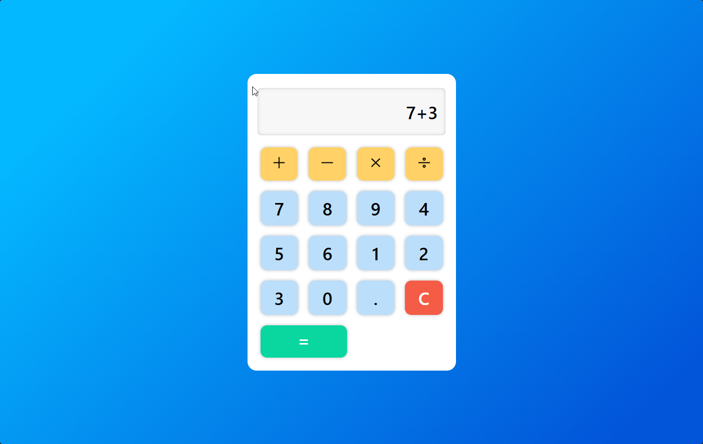

# Calculator Web App

A lightweight browser-based calculator built with HTML, CSS, and JavaScript. It includes arithmetic operations, a clear function, and a responsive layout styled to resemble a modern calculator interface.

## Live Demo

Hosted app: [Click Here](https://calculator-nyc.vercel.app/)

## Screenshot



## Features

- Basic arithmetic operations: addition, subtraction, multiplication, and division
- Numeric keypad for entering values
- Clear button to reset the display
- Equals button to evaluate the expression
- Clean, responsive calculator UI
- No build step required for simple local use

## Tech Stack

- HTML5
- CSS3
- JavaScript (vanilla)

## Project Structure

```text
Calculator/
├── index.html          # Main calculator layout
├── style.css           # Styling and visual design
├── script.js           # Calculator logic and event handlers
├── src/
│   ├── icons8_plus_math.svg
│   ├── icons8_subtract.svg
│   ├── icons8_multiply.svg
│   └── icons8_divide.svg
└── README.md           # Project documentation
```

## How to Run Locally

### Option 1: Open directly in the browser

1. Navigate to the project folder.
2. Open `index.html` in your browser.

### Option 2: Run a local web server

From the project directory, run:

```bash
python -m http.server 8000
```

Then open:

```text
http://localhost:8000
```

## How It Works

The app uses:

- `index.html` to define the calculator structure
- `style.css` for layout, colors, spacing, and button styling
- `script.js` to capture button clicks and evaluate expressions using JavaScript

When a user presses a number or operator, the value is appended to the display. The clear button resets the current result, and the equals button evaluates the expression using JavaScript's `eval()`.

## Notes

This project is intentionally simple and beginner-friendly. It is ideal for learning how to combine HTML, CSS, and JavaScript for a functional front-end app.

## Future Improvements

- Support for keyboard input
- Improved error handling for invalid expressions
- More advanced operations such as percentages, memory functions, or parentheses
- Better accessibility support

## License

This project is provided for educational and personal use.

## Author

Yimnai Conrad.
